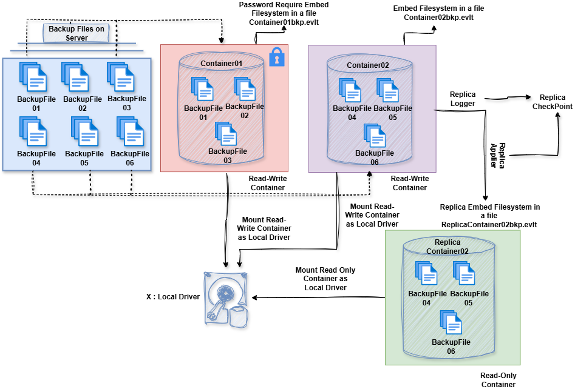

Elysium

Elysium is a project I’ve been developing in my free time.
It is a container-based embedded filesystem designed to securely store and manage your files.

🔒 Key Features

Store any type of file inside a container file

Protect containers with passwords or encryption

Create replicas for additional safety (asynchronous or synchronous mode)

Mount containers as a local drive on Windows

Access files directly through Elysium without mounting

⚙️ How It Works

Each container file includes its own embedded filesystem.
You can move it anywhere and still open it securely.

Replication is powered by two processes:

Replica Logger → records all file operations

Replica Applier → applies logs and checkpoints when the container is opened, keeping replicas automatically in sync

This approach makes it possible to manage your data securely, efficiently, and with built-in redundancy.

📂 Architecture Diagram

Watch the demo on YouTube:  
👉 [Elysium Demo](https://www.youtube.com/watch?v=Itgas3Z1Qdk&t=6s)

